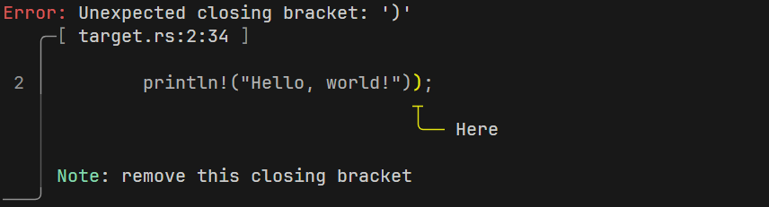

# Ariadnenum

[](https://crates.io/crates/ariadne)
[](https://docs.rs/ariadne)
[](https://github.com/zesterer/ariadne)


An proc macro crate to easily generate [Ariadne](https://github.com/zesterer/ariadne) diagnostics from enum variants.

## Example


```rust
use std::ops::Range;

use ariadne::{Color, Config, Report, ReportKind, Source};
use ariadnenum::Ariadnenum;

#[derive(Ariadnenum)]
enum LexingError {
        #[report(
        kind = ariadne::ReportKind::Error, // Default = ReportKind::Error
        config = ariadne::Config::new().with_index_type(ariadne::IndexType::Byte), // Default = None
        code = 300 // Default = None
    )]
    #[message("Unexpected closing bracket: '{}'", kind)] // Error message 
    #[note("remove this closing bracket")] // Note message below
    BracketMismatch {
        #[colored(ariadne::Color::Yellow)] // Place #[colored] before #[label] to change the
                                           // color of the label, default = Color::Red
        #[label("Bracket {} is here", kind)] // Label "Bracket {kind} is here" pointing at {location}
        #[here] // Determine error main location
        location: Range<usize>,
        kind: char,
    },
    
    #[report(
        kind = ariadne::ReportKind::Warning,
    )]
    #[message("Unused Semicolon")]
    #[note("remove this closing bracket")]
    UnusedSemicolon ( // Unnamed variants are supported
        #[colored(ariadne::Color::Yellow)]
        #[label("Here")] 
        #[here]
        Range<usize>,
        char,
    ),
}

fn main() {
    let source = 
    r#"fn main() {
        println!("Hello, world!"));
    }"#;

    let result: Result<(), std::io::Error> = LexingError::BracketMismatch {
        location: 45..46,
        kind: ')'
    }.eprint_report("target.rs", Source::from(source.to_string())); // Print error report to stderr
}
```